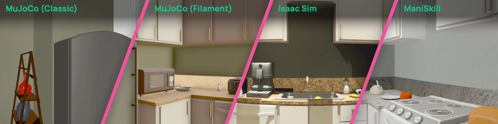
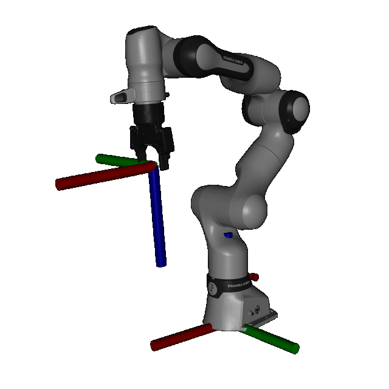

<div align="center">
  
  <br>
  <br>
  <h1>MolmoSpaces: A Large-Scale Open Ecosystem for Robot Manipulation and Navigation</h1>
</div>

</br>
<div align="center">
  <a href="http://allenai.org/papers/molmospaces" target="_blank" rel="noopener noreferrer"></a>&nbsp;&nbsp;<a href="https://huggingface.co/datasets/allenai/molmospaces" target="_blank" rel="noopener noreferrer"></a>&nbsp;&nbsp;<a href="https://molmospaces.allen.ai/" target="_blank" rel="noopener noreferrer"></a>&nbsp;&nbsp;<a href="https://molmospaces.allen.ai/leaderboard" target="_blank" rel="noopener noreferrer"></a>
</div>
<br/>

<div align="center">
  
  <br>
  <p>Assets from MolmoSpaces are usable in MujoCo, Isaac, and ManiSkill.
  <br>
</div>


---
### Updates
- **[Coming Soon]** 🔥 Code for scripted planners, data generation, and benchmark creation
- **[2026/02/27]** 🔥 **Leaderboards** are [out](https://molmospaces.allen.ai/leaderboard).
- **[2026/02/11]** 🔥 **Benchmark** for 8 tasks, including *pick*, *open*, and *close* tasks in JSONs
- **[2026/02/11]** 🔥 **Datasets** for assets and scenes in MJCF and USDa format,
- **[2026/02/11]** 🔥 **MolmoSpaces** Code for scene conversion, grasp generation, teleoperation, and benchmark evaluation.


## Installation

Installing `molmospaces` is easy!

First, set up a conda environment with Python 3.10:

```bash
conda create -n mlspaces python=3.10
conda activate mlspaces
```


Then, clone and install the project:

```bash
git clone git@github.com:allenai/molmospaces.git
cd molmospaces
```

You can either use `uv`
```bash
uv pip install -e .[dev,grasp]
```
The installation options are:
- `dev` installs dependencies for code development
- `grasp` installs dependencies for the grasp generation pipeline
- `housegen` installs dependencies for house generation pipeline from iTHOR, ProcTHOR, or Holodeck JSONs


<!--
You may wish to specify some [environment variables](#environment-variables) to configure behavior.

### Installing Curobo and/or resource uploader (optional)

For curobo support, instead install with:

```bash
conda install -c conda-forge ninja
pip install -e .[dev,curobo]
```

> [!NOTE]
> This has been tested on image `ai2/cuda12.8-dev-ubuntu22.04-notorch`, and should work for similar images.

For curobo and resource uploader (`mjt_upload`), install with:
```bash
conda install -c conda-forge ninja
pip install -e .[dev,curobo,resources]
```

-->

### Set Environment Variables (Optional)

You may wish to specify some environment variables to configure behavior.
Environment variables beginning with the `MLSPACES` prefix can be used to customize MolmoSpaces behavior.

| Environment Variable | Effect | Default |
|---|---|---|
| `MLSPACES_ASSETS_DIR` | Where to place downloaded assets | `../docs/images` relative to `molmo-spaces` directory |
| `MLSPACES_AUTO_INSTALL` | Update assets without prompting | `True` |
| `MLSPACES_FORCE_INSTALL` | Override existing assets | `True` |
| `MLSPACES_PINNED_ASSETS_FILE` | A `.json` file containing pinned versions for each asset, used to override the versions specified in [molmo_spaces_constants.py](molmo_spaces/molmo_spaces_constants.py). |  |

## MolmoSpaces Assets

Molmospaces provides scenes, objects, robots, and benchmarks. These can be downloaded using an asset manager to automatically fetch and version-control asset dependencies. 

A number of assets are provided; this overview explains the naming of the assets in code:
| Type | Code Name | Paper Name |Desciption|Size|
|---|---|---|---|---|
| objects| thor |   |hand-crafted kitchen assets ~1.1k||
| objects| objaverse |  |converted Objaverse assets ~130k||
| scenes | ithor | MSCrafted |hand-crafted, may articulated assets||
| scenes | procthor-10k | MSProc | procedurally generated with THOR assets||
| scenes | procthor-objaverse | MSProcObja |procedurally generated with Objaverse assets||
| scenes | holodeck | MSMultiType |LLM generated with Objaverse assets||
| benchmark|   | MS-Bench v1 | base benchmark for atomic tasks ||


### MuJoCo Quick Start

**Scene downloading.**  Assuming we have exported some convenient `MLSPACES_ASSETS_DIR`, we can install our first scene by:

```python
from molmo_spaces.utils.lazy_loading_utils import install_scene_with_objects_and_grasps_from_path
from molmo_spaces.molmo_spaces_constants import get_scenes

install_scene_with_objects_and_grasps_from_path(get_scenes("ithor", "train")["train"][1])
```

and view it with

```bash
python -m mujoco.viewer --mjcf $MLSPACES_ASSETS_DIR/scenes/ithor/FloorPlan1_physics.xml
```

**Object downloading.** All `thor` objects are downloaded, extracted and symlinked upon instantiation of the resource manager. If we want to download some asset of, e.g., category "apple", we can do so like:
```python
import random
from pprint import pprint

from molmo_spaces.utils.object_metadata import ObjectMeta
from molmo_spaces.utils.lazy_loading_utils import install_uid

annotation = ObjectMeta.annotation()

# We exclude thor assets, which are installed
apple_annotations = [anno for anno in annotation.values() if "apple" in anno["category"].lower() and anno["isObjaverse"]]
random_apple = random.choice(apple_annotations)

print("Object annotation:")
pprint(random_apple)

apple_model_path = install_uid(random_apple["assetId"])
print(f"Object downloaded and symlinked to {apple_model_path}")
```


### Isaac-Sim Quick Start

Please refer to this [README.md](molmo_spaces_isaac/README.md) for instructions
on how to setup and use the `MolmoSpaces` assets in `IsaacSim`.

### ManiSkill Quick Start

Please refer to this [README.md](molmo_spaces_maniskill/README.md) for instructions
on how to setup and use the `MolmoSpaces` assets in `ManiSkill`.


### Example of Pinned Assets File (Optional)
The pinned assets file should have the same structure as `DATA_TYPE_TO_SOURCE_TO_VERSION` in [molmo_spaces_constants.py](molmo_spaces/molmo_spaces_constants.py). For example:
```json
{
    "robots": {
         "franka_droid": "20260127"
    },
    "scenes": {
        "ithor": "20251217"
    }
}
```

## MolmoSpaces Benchmarks

Currently, installing and running the benchmark is only supported in MuJoCo simulator.

### Install the Benchmark

```bash
export MLSPACES_ASSETS_DIR=/path/to/symlink/resources
python -m molmo_spaces.molmo_spaces_constants
```

### Run the Benchmark

```bash
python molmo_spaces/evaluation/eval_main.py \
    molmo_spaces.evaluation.configs.evaluation_configs:PiPolicyEvalConfig \
    --benchmark_dir assets/benchmarks/path-to-benchmark/ \
    --task_horizon_steps 500
```

For more information, please refer to the instruction in [benchmark](molmo_spaces/evaluation/README.md).


## Teleop Input

To control a robot via phone based teleoperation do the following (only iPhones supported).

1. Install TeleDex from the App Store see [here](https://apps.apple.com/us/app/teledex/id6612039501).
2. Run the datagen pipeline with the teleop policy
   ```bash
   python molmo_spaces/evaluation/eval_main.py \
    molmo_spaces.evaluation.configs.evaluation_configs:TeleopPolicyEvalConfig \
    --benchmark_dir assets/bench/path-to-bnechmark.json \
    --task_horizon_steps 1000
    ```
3. Ensure your phone and the machine running the pipeline are connected to the same network.
4. Scan the QR-Code that shows up using the app (or manually enter the ip:port) while connected to a similar network. Example terminal output:
   ```bash
   TeleDex Session Starting on port 8888...
   Session Started. Details:
   IP Address: xxx.xxx.xx.xxx
   Port: 8888
   Waiting for a device to connect...
   ```
5. Start teleoperating!

- Click the Toggle to Grasp
- Click the Button to go to the next episode


## Development

### Code Formatting

Before committing, ensure your code is formatted:
```bash
ruff format .
```

<!--
### Testing

We use pytest for integration testing.

```bash
PYTHONPATH=. pytest mlspaces_tests/data_generation
PYTHONPATH=. pytest mlspaces_tests/data_generation_curobo  # run tests that require curobo
```

> [!TIP]
> To debug failing tests, use `--log-cli-level DEBUG`

For setting up self-hosted CI runners or building Docker images for Beaker, see **[beaker_scripts/RUNNER_SETUP.md](beaker_scripts/RUNNER_SETUP.md)**.
-->

### Use with Cursor/VSCode

Generating type stubs for mujoco and open3d and saving them in the `typings` folder
```bash
pybind11-stubgen mujoco -o ./typings/
```

### Mujoco Viewer Tips
1. Documentation for the viewer can be found [here](https://mujoco.readthedocs.io/en/stable/programming/samples.html#sasimulate), there are many keyboard shortcuts.
2. If you have red boxes on top of your objects, go to the left panel and toggle `Group Enable > Site groups >  Site 0`
3. Interact with objects by double-clicking > Ctrl + right mouse drag. (only with active viewers, not passive ones)


## Robot Conventions

Robot base conventions: +x=forward, +y=left, +z=up

Robot parallel-jaw gripper conventions: +z=forward, fingers open along y axis




## License

The codebase is licensed under [Apache 2.0](https://www.apache.org/licenses/LICENSE-2.0.txt).
The public MolmoSpaces data endpoint is available [here](https://pub-3555e9bb2d304fab9c6c79819e48aa40.r2.dev). The public MolmoSpaces Isaac data endpoint is available [here](https://pub-96496c3574b24d0c98b235219711d359.r2.dev). Both datasets are also available for download on [HuggingFace](https://huggingface.co/datasets/allenai/molmospaces). The Objaverse subsets in these buckets are licensed under [ODC-BY 1.0](https://opendatacommons.org/licenses/by/1-0/). All other data subsets are licensed under [CC BY 4.0](https://creativecommons.org/licenses/by/4.0/deed.en).
The artifacts are intended for research and educational use in accordance with [Ai2's Responsible Use Guidelines](https://allenai.org/responsible-use).

## Data Attributions

The xml files have been modified from the original versions provided by the following sources:
- [mujoco_menagerie / franka_fr3](https://github.com/google-deepmind/mujoco_menagerie/tree/main/franka_fr3) - Developed by Franka Robotics
- [mujoco_menajerie / robotiq_2f85_v4](https://github.com/google-deepmind/mujoco_menagerie/tree/main/robotiq_2f85_v4) - Copyright (c) 2013, ROS-Industrial
- [Rainbow Robotics / rby1-sdk](https://github.com/RainbowRobotics/rby1-sdk) - Copyright 2024-2025 Rainbow Robotics
- [CAP Gripper](https://github.com/jeffacce/cap-policy) - Copyright (c) 2026 NYU Generalizable Robotics and AI Lab (GRAIL)

## Citing

```
@misc{molmospaces2026,
    title={MolmoSpaces: A Large-Scale Open Ecosystem for Robot Navigation and Manipulation},
    author={Yejin Kim and Wilbert Pumacay and Omar Rayyan and Max Argus and Winson Han and Eli VanderBilt and Jordi Salvador and Abhay Deshpande and Rose Hendrix and Snehal Jauhri and Shuo Liu and Nur Muhammad Mahi Shafiullah and Maya Guru and Arjun Guru and Ainaz Eftekhar and Karen Farley and Donovan Clay and Jiafei Duan and Piper Wolters and Alvaro Herrasti and Ying-Chun Lee and Georgia Chalvatzaki and Yuchen Cui and Ali Farhadi and Dieter Fox and Ranjay Krishna},
    year={2026},
}
```
