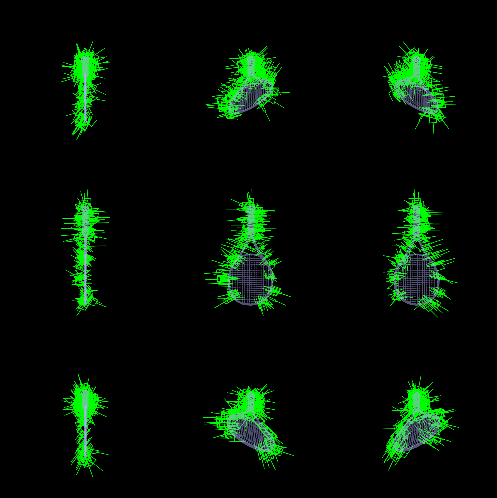
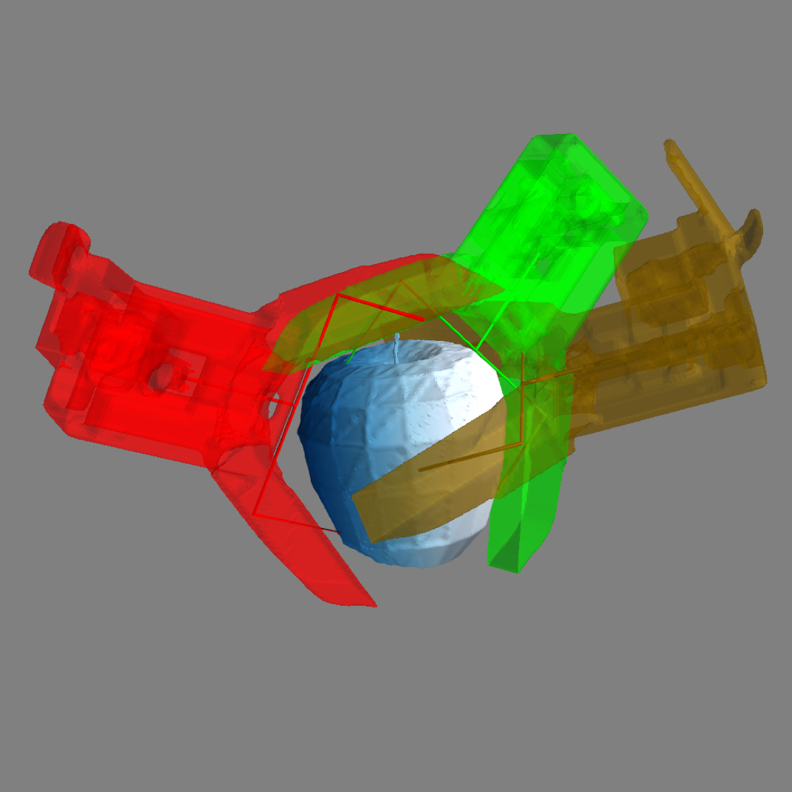
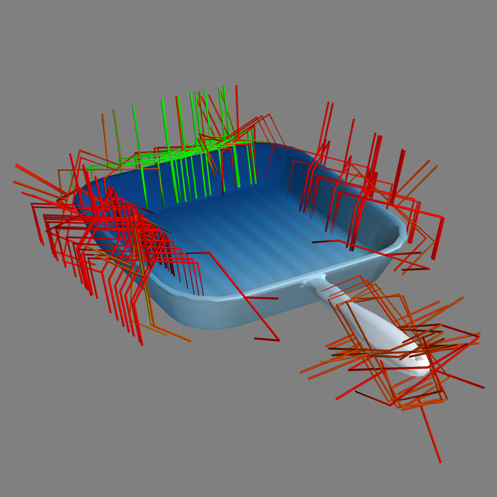
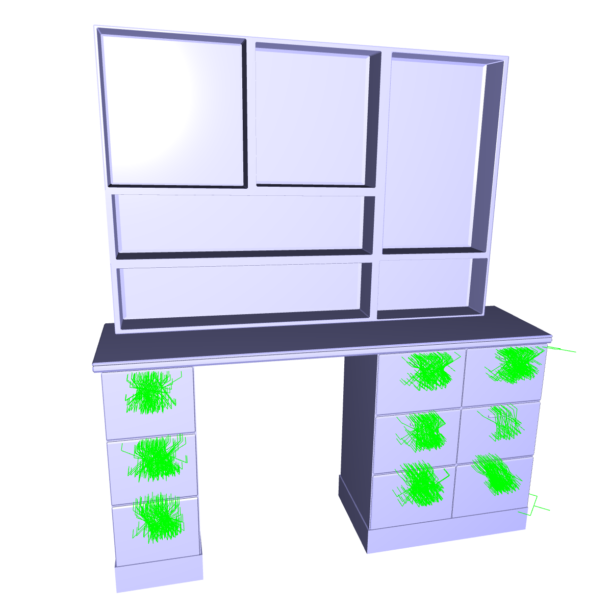
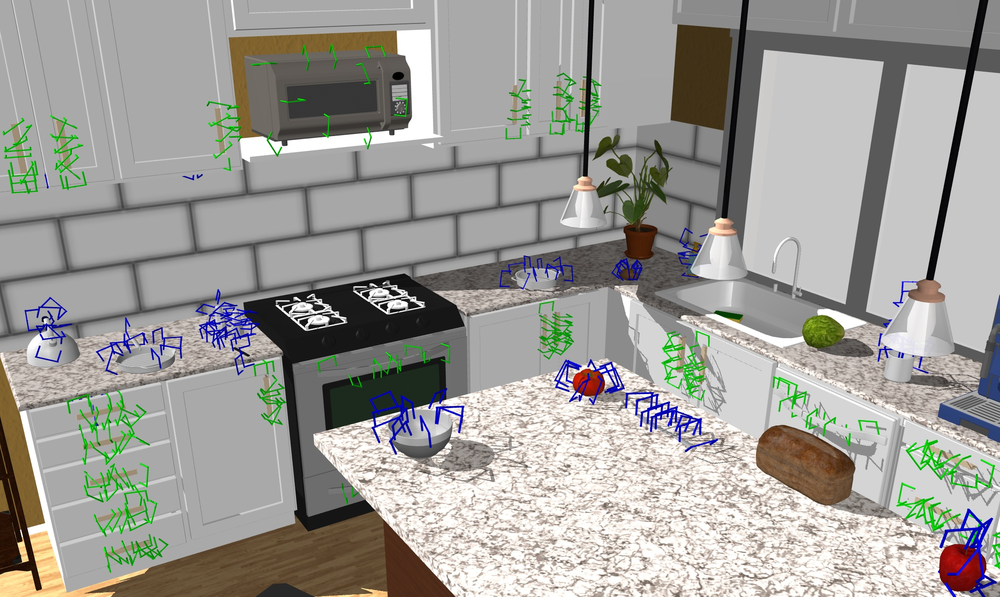

# mjcf2grasp
`molmo_spaces.grasp_generation` lets you generate and verify functional grasps from an [MJCF](https://mujoco.readthedocs.io/en/stable/XMLreference.html) file using [MuJoCo](https://mujoco.org/).

<p>
  
  
  
  
</p>


## Installation

Install dependencies for running grasp generation pipeline

```bash
pip install -e .[grasp]
```

Build the Manifold library (required for mesh processing):

```bash
git submodule update --init --recursive
cd external_src/Manifold
mkdir build && cd build
cmake ..
make
```

## Usage

### Rigid Objects

#### 1. Prepare Object List

Create a JSON file containing a list of MJCF objects to process. Each object needs a `name` and `xml` path:

```json
[
    {
        "name": "Tennis_Racquet_5",
        "xml": "/path/to/Tennis_Racquet_5/Tennis_Racquet_5.xml"
    },
    {
        "name": "Pen_1",
        "xml": "/path/to/Pen_1/Pen_1.xml"
    },
  ]
```

An example command to get the object list

```bash
python find_objects.py ../../assets/objects/thor --output ../../grasp_results/rigid_objects_list.json
```

#### 2. Run the Pipeline

```bash
python run_rigid.py --objects_list ../../grasp_results/rigid_objects_list.json
```

#### 3. Results

Results are saved to `grasp_results/rigid_objects/<object_name>/`:

```
results/rigid_objects/
└── Tennis_Racquet_5/
    └── Tennis_Racquet_5_grasps_filtered.npz
```

The `.npz` file contains the validated grasp transforms.

#### 4. Visualize Results

```bash
python scripts/grasps/generation/visualize_meshcat.py --objects_list grasp_results/rigid_objects_list.json
```

Use arrow keys (or `n`/`p`) to navigate between objects, `q` to quit.

### Articulable Objects

#### 1. Prepare Object List

Create a JSON file containing a list of articulable MJCF objects to process. Each object needs a `name` and `xml` path:

```json
[
    {
        "name": "Doorway_1",
        "xml": "/path/to/Doorway_1/Doorway_1.xml"
    }
]
```

An example command to get the object list

```bash
python find_objects.py ../../assets/objects/thor --output ../../grasp_results/articulable_objects_list.json --check-joints
```

#### 2. Run the Pipeline

```bash
python run_articulable.py --objects_list grasp_results/articulable_objects_list.json
```

#### 3. Results

Results are saved to `grasp_results/articulable_objects/<object_name>/`:

```
results/articulable_objects/
└── Doorway_1/
    ├── main.obj
    ├── joint_meshes_info.json
    ├── joint_meshes_info_filtered.json
    └── Doorway_1_doorway_handle_1_joint_0_grasps_filtered.npz
```

The filtered JSON and NPZ files contain per-joint validated grasp transforms.

#### 4. Visualize Results

```bash
python scripts/grasps/generation/visualize_meshcat.py \
    --objects_list grasp_results/articulable_objects_list.json \
    --results_dir grasp_results/articulable_objects \
    --articulable \
    --max_grasps_per_joint 10
```

Use arrow keys (or `n`/`p`) to navigate between objects, `q` to quit. Different joints are shown in different colors.


## Loading functional grasps in the `MolmoSpaces` scenes

In MacOS, use `mjpython` instead of `python` to launch and use the passive visualizer

```bash
python scripts/grasps/view_grasps.py --scene_index 1 --dataset_name ithor --split train --number_of_grasp_per_object 10
```



